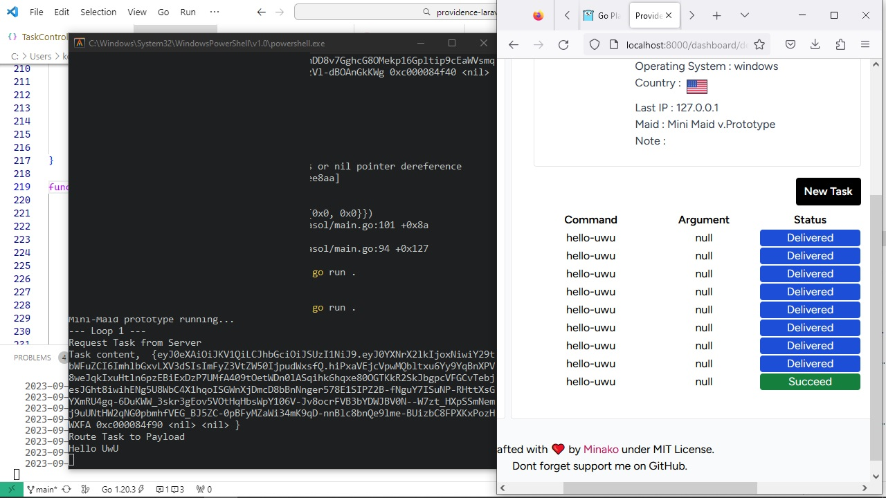

# Providence 

 

Providence is minimalist command and control for watching your device, similar like Google Find My Device but a message broker to remote control your device rather a device tracker with map.

## Implant

Since codegen not ready, [here an example for it](https://gist.github.com/minako2/512d3ff1f2d817dcb22927db0da699c0).

## How it works

Providence work as message passing to your devices from web pannel you've seen above. You giving order from there and the device will receive message. Each message are consist of command and argument, called as Task. Task have schema to define what command and abilities need to run, contract between Providence and you devices.
These scheme called Maid. The devices without proper Maid-defined command or ability will ignored to handshaking, receiving and reporting task.

Providence and devices require do handshake at first, 
this need to device obtain id to receive task. 
Device will periodically (further improvement, may 
realtime) to check there are task for you devices. 
After, receiving task the device should do report back
to Providence. Here one cycle of task-report.

You still need implpement program to interpret what Providence message give and report back. Codegen available to generate template of code to register device to server, receive and report message. So, you just focus on writting logic of the message that should behave on device.

## Feature

- [x] Basic functionality (such maid register, device callback hook).
- [ ] Basic Codegen for creating client stub.
- [ ] Developer API.
- [TBD] Rewrite to better performant language without loosing the conviniece.

## Dependencies

- PHP 8.x with Composer installed and `php.ini` already configured for Laravel use (extension such: `curl`, `intl`, `mbstring`, `openssl`, `mysqli`, `pdo_mysql`, `fileinfo`, etc). 
- NodeJS 16.x
- Openssl

## How to run Providence
-  First-time only step here and after install dependecies, do once if you have not do it.
    - clone this repository to a directory/folder.
    - open the directory as working directory in terminal.
    - if you use Unix-like OS, just run `first-time-huh.sh` for conviniece, for database connection to migration you sholud configure by yourself.
    - if you use Windows, just run `first-time-huh.bat` for conviniece, for database connection to migration you sholud configure by yourself.
    - run `composer install`, to install php deps.
    - run `npm install` to install javascript deps.
    - run `php artisan key:generate`, to generate app key pair.
    - ip-country database require manual configuration, by default use `maxmind_database` as provider. You can obtain geoiplite api from `www.maxmind.com` then put the key in `MAXMIND_LICENSE_KEY` at `.env` file or tweaking config at `config/geoip.php` for custom ip-country database setup. (Required for next step, psst check [my stared repo for good resource](https://github.com/minako2?tab=stars)).
    - run `php artisan geoip:update`, to download  ip-country database.
    - open `.env` and understanding it the content that the app configuration, such database connection, etc.
    - After setting up database w/o `first-time-huh` script, run `php artisan migrate`.
- run `npm run build` to setup javascript assets, such tailwind styling, etc. Run this if you do change in app especialy related with tailwind and view stuff.
- run `php artisan serve`, this last step to spin up app, just run this once if your just want to run app and press `Ctrl+C` if you want quit.